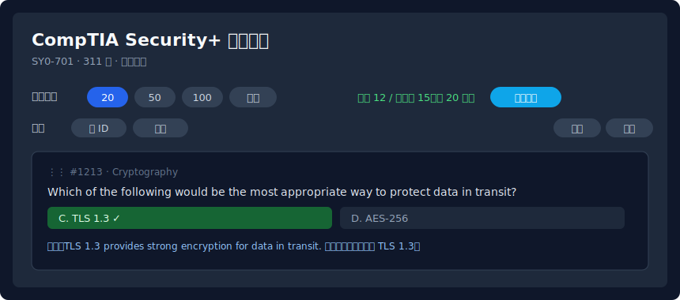

# security-quiz（繁體中文）

[](https://github.com/Openbox7681/security-quiz/actions/workflows/docker.yml)

一個靜態的 **CompTIA Security+（SY0-701）** 練習題網站，透過 nginx + Docker 提供服務。

English version: **[README.md](README.md)**.



> 上圖為介面示意圖（mockup）——實際截圖可參考 [docs/screenshots/](docs/screenshots/) 替換。

## 功能

- **檔案式題庫** — 題目放在 `src/questions*.json`，新增檔案後在 `src/index.html` 的 `QUESTION_SOURCES` 註冊即可。
- **開始時選擇題數** — 20 / 50 / 100 / 全部，以亂數（Fisher–Yates）抽題。
- **調整順序與重抽** — 可拖曳排序、依 id 排序、洗牌，或重新抽一組新題。
- **分頁** — 每頁 5 題，提供第一頁／上一頁／下一頁／末頁與跳頁輸入。
- **每題複製鈕** — 一鍵複製題目、選項與正確答案（並附上「請詳解」提示），方便貼到另一個 AI 取得詳解。
- **匯入 / 匯出** 題庫為 JSON。
- **雙語詳解** — 每題 `exp` 欄位皆為「英文句子 + 中文註記」。
- **即時計分** 並於作答後鎖定；測驗進度存於 `localStorage`（重新整理仍是同一份考題）。

## 本機執行

```bash
docker compose up -d
# 開啟 http://localhost:8080
```

> 本站以 `fetch()` 載入 JSON 題庫，因此必須透過 HTTP（Docker）提供，**不能**用 `file://` 直接開啟。

## 執行已發佈的映像檔

每次 push 到 `main` 都會自動建置並發佈映像檔到 GitHub Container Registry：

```bash
docker run -d -p 8080:80 ghcr.io/openbox7681/security-quiz:latest
# 開啟 http://localhost:8080
```

## 題庫

**共 714 題** — 原始 8 題 + SY0-701 考古題 706 題（id `1001`–`1708`），每題皆附雙語詳解。

### 題目格式

```json
{
  "id": 1213,
  "tags": ["SY0-701", "Cryptography"],
  "q": "Which of the following would be the most appropriate way to protect data in transit?",
  "options": { "A": "SHA-256", "B": "SSL 3.0", "C": "TLS 1.3", "D": "AES-256" },
  "correct": "C",
  "exp": "TLS 1.3 provides strong encryption for data in transit. 保護傳輸中資料應用 TLS 1.3。"
}
```

複選題會帶 `複選` 標籤，`correct` 以多個字母表示（例如 `"BF"`）。

### 新增題目

1. 依上述格式建立 `src/questions-sy0701-6.json`（檔名可自訂），使用新的 id。
2. 把檔名加進 [`src/index.html`](src/index.html) 的 `QUESTION_SOURCES`。
3. Commit 並 push — CI 會驗證 JSON（解析與重複 id 檢查）並重新發佈映像檔。

## CI 說明

`.github/workflows/docker.yml`：

- **validate** — 解析每個 `questions*.json`、檢查必要欄位，若有重複 id 或 `correct` 字母不在 `options` 中就失敗；並語法檢查 `index.html` 內嵌 JS。
- **docker** — push 到 `main` 時建置映像檔並推送到 `ghcr.io/openbox7681/security-quiz`。
